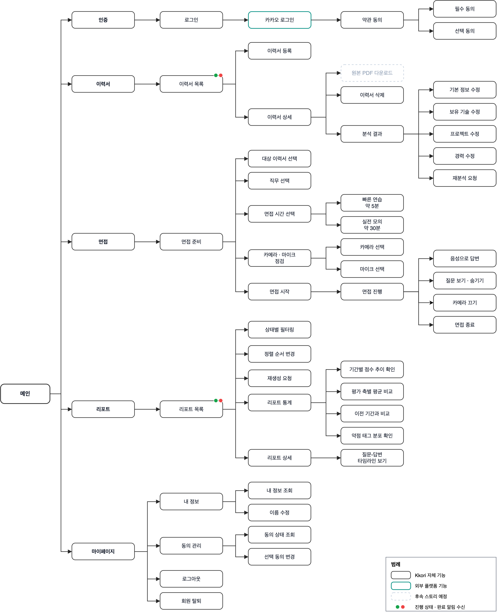
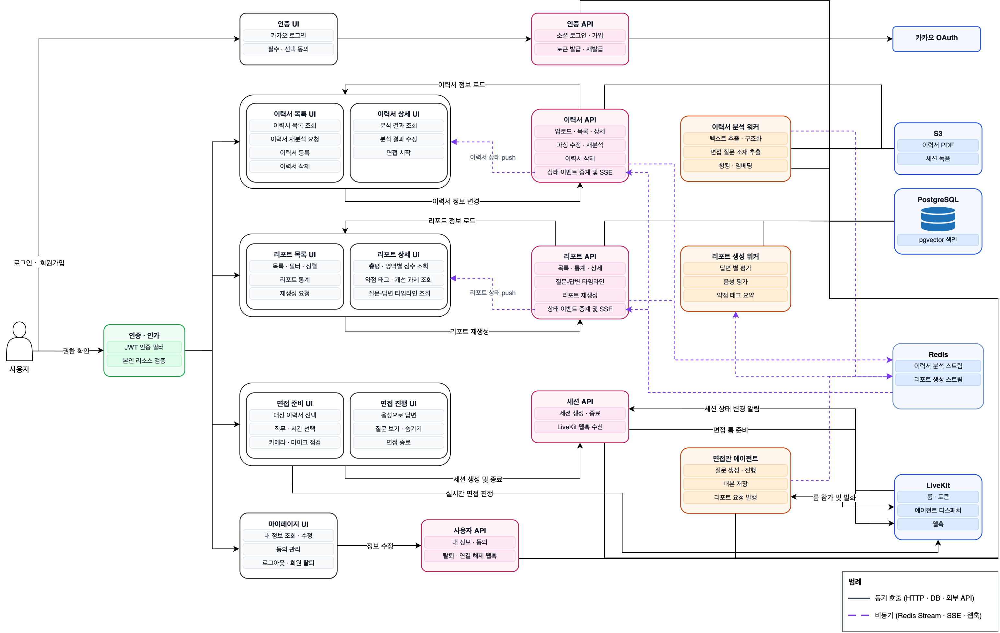
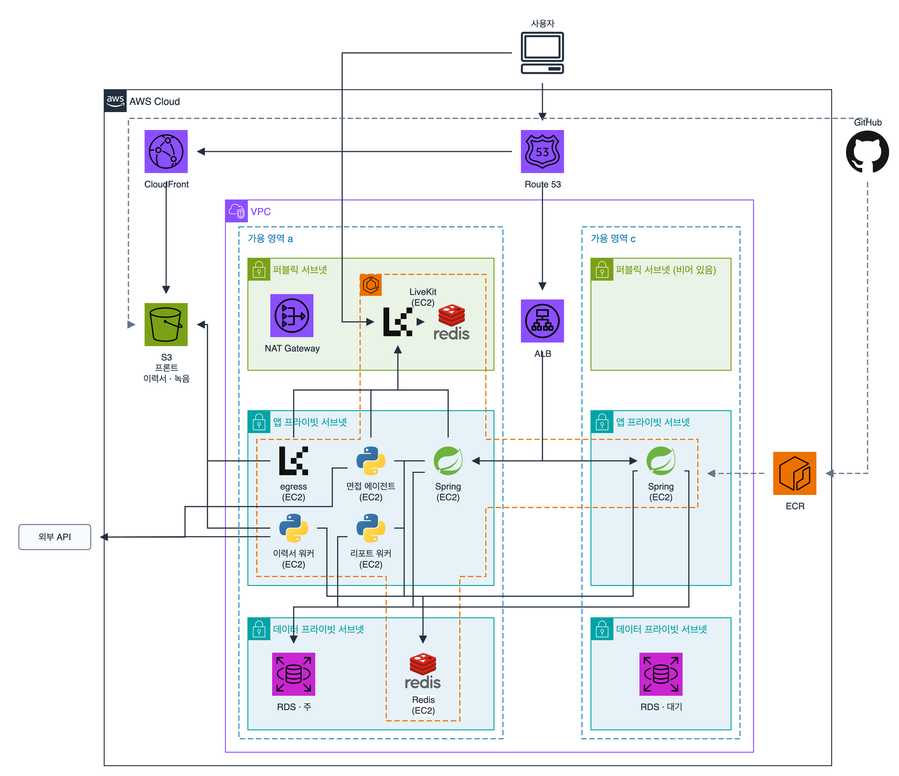
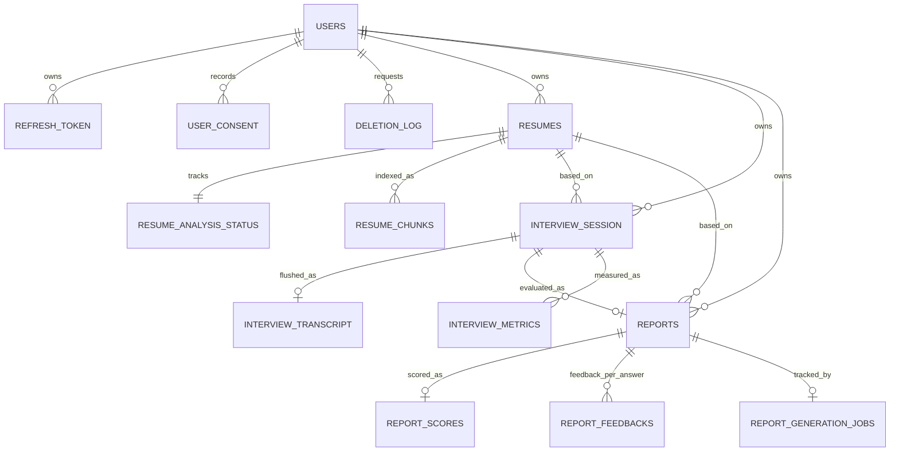
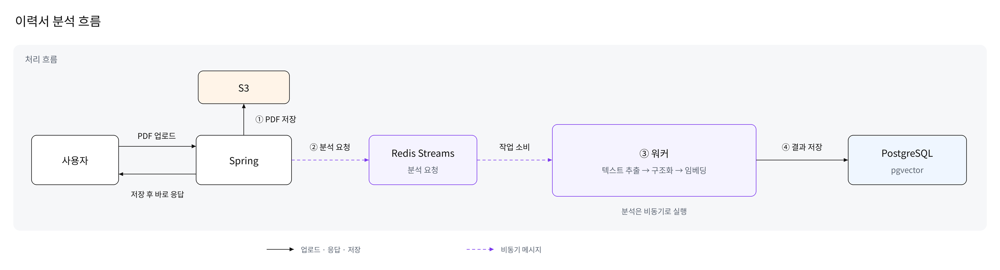
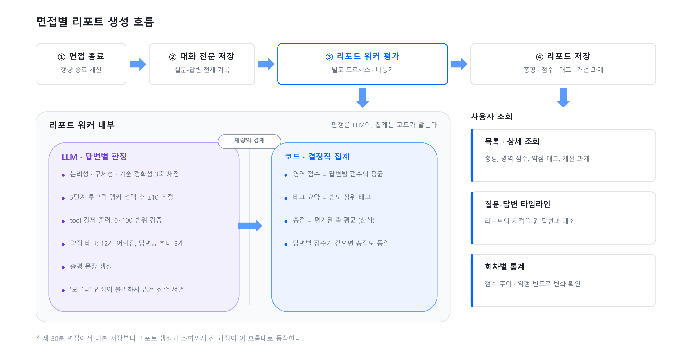
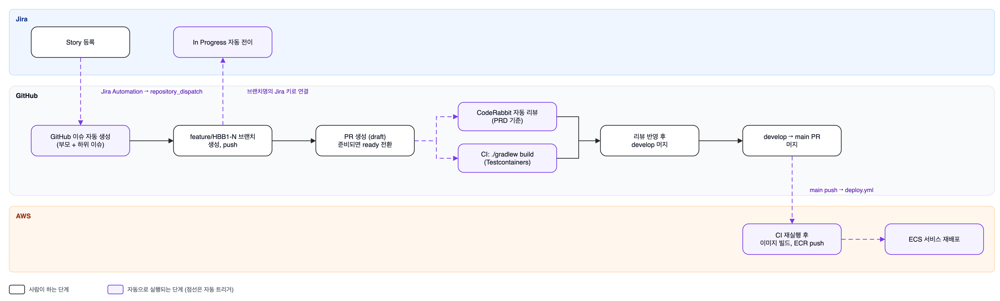

<!-- 꼬리 로고: 파일이 준비되면 아래 제목 위에 넣는다 -->

# 꼬리 (Kkori) Backend

이력서를 분석해 맞춤 질문을 만들고, AI 면접관과 실시간 음성으로 모의 면접을 진행한 뒤 답변별 피드백 리포트를 제공하는 AI 면접 준비 서비스의 백엔드입니다. SW마에스트로 17기 팀 HBB에서 개발합니다.

<!-- 이 README는 쇼케이스(포트폴리오) 용도다. 개발 규칙과 패키지 구조는 하단 "개발 문서" 참조. -->

## 1. 프로젝트 개요

### 1-1. 프로젝트 소개

혼자 면접을 준비하면 내 이력서를 기준으로 질문을 받고 답변을 평가받을 방법이 없습니다. 꼬리는 사용자가 올린 이력서 PDF를 분석해 그 내용에 맞는 질문을 만들고, AI 면접관과 실시간 음성으로 모의 면접을 진행합니다. 면접이 끝나면 질문과 답변 기록을 평가해 총평, 영역별 점수, 답변별 피드백, 약점 태그, 개선 과제를 담은 리포트를 만들고, 사용자는 회차별 통계로 변화를 확인합니다.

백엔드는 Spring 서버와 Python 워커로 나뉩니다. Spring 서버는 인증, 이력서, 면접 세션, 리포트 API를 맡고, 시간이 오래 걸리는 이력서 분석과 리포트 생성은 Redis Streams로 Python 워커에 넘깁니다. 면접은 LiveKit 룸에서 진행합니다. Spring 서버가 룸을 만들고 면접관 에이전트를 디스패치하면, 에이전트가 질문을 이어가고 면접이 끝나면 대본을 저장한 뒤 리포트 생성을 요청합니다. 이 저장소는 Spring 서버이고, 워커와 에이전트는 [Kkori-AI](https://github.com/SW-Maestro-17th-HBB/Kkori-AI), 웹 화면은 [Kkori-Frontend](https://github.com/SW-Maestro-17th-HBB/Kkori-Frontend)에 있습니다.

### 1-2. 주요 기능과 데모

<!-- 데모 URL과 화면 스크린샷이 준비되면 여기에 넣는다 -->

- **이력서**: PDF를 올리면 분석 단계(텍스트 추출, LLM 구조화, 청킹, 임베딩)가 바뀔 때마다 SSE로 상태를 받습니다. 분석 결과(기본 정보, 보유 기술, 프로젝트, 경력)를 수정하거나 재분석을 요청할 수 있습니다.
- **면접**: 이력서와 직무, 면접 시간(빠른 연습 약 5분, 실전 모의 약 30분)을 고르고 카메라와 마이크를 점검한 뒤 AI 면접관과 음성으로 면접을 진행합니다. 연결이 끊기면 진행 중인 세션에 다시 들어갑니다.
- **리포트**: 총평, 영역별 점수(논리성, 구체성, 기술 정확성, 전달력), 답변별 피드백과 이력서 근거, 약점 태그, 개선 과제를 봅니다. 질문과 답변 타임라인으로 지적을 원래 답변과 대조하고, 회차별 통계로 점수 추이와 약점 빈도를 확인합니다.
- **계정**: 카카오 로그인, 필수와 선택 동의 관리, 회원 탈퇴.

### 1-3. 기술 스택

- **애플리케이션**: Java 21, Spring Boot 3.5, Spring Data JPA, Spring Security, OAuth2 Client(카카오), JWT(jjwt), springdoc-openapi, Actuator와 Micrometer(Prometheus)
- **데이터**: PostgreSQL 16(pgvector), Redis 7(Streams, Pub/Sub), S3(Spring Cloud AWS, 로컬은 MinIO)
- **실시간과 문서 처리**: LiveKit Server SDK, PDFBox
- **테스트와 배포**: JUnit 5, Testcontainers(PostgreSQL, Redis, MinIO), GitHub Actions, Docker, AWS ECS와 ECR

## 2. 개발 결과물

### 2-1. Information Architecture



서비스의 화면과 기능을 트리 하나로 정리한 화면 맵입니다. 인증, 이력서, 면접, 리포트, 마이페이지 다섯 갈래로 나뉘고, 이력서 목록과 리포트 목록은 분석과 생성의 진행 상태를 알림으로 받습니다. 점선 상자는 후속 스토리로 미뤄 둔 기능입니다.

### 2-2. Application Architecture



화면의 기능 하나가 어느 API를 거쳐 어느 워커와 저장소에 닿는지 매핑한 상세도입니다. 실선은 HTTP, DB, 외부 API 같은 동기 호출이고, 점선은 Redis Streams, SSE, 웹훅 같은 비동기 경로입니다. 이력서 분석과 리포트 생성은 API가 Redis에 요청을 발행하고 워커가 처리한 뒤 상태를 SSE로 돌려주는 경로로만 API와 이어집니다.

### 2-3. Cloud Architecture



AWS 배치도입니다. 컴퓨팅은 ECS on EC2로, 역할별로 EC2 인스턴스를 1대씩 두고 각 서비스를 그 노드에 고정 배치합니다. 서브넷을 퍼블릭, 앱, 데이터 세 층으로 나누고 가용영역 두 곳에 걸쳐 두었습니다. 사용자 요청은 Route 53과 ALB를 거쳐 Spring으로 들어오고, 프론트 정적 파일은 CloudFront와 S3가 서빙합니다. 면접 음성은 WebRTC로 퍼블릭 서브넷의 LiveKit에 직접 붙습니다. 워커와 에이전트는 앱 프라이빗 서브넷에서 NAT Gateway를 거쳐 외부 API를 호출하고, RDS는 주와 대기로 이중화했습니다.

### 2-4. DB 스키마



테이블 14개를 사용자, 이력서, 면접 세션, 리포트 네 묶음으로 나눴습니다. 이력서는 업로드 원본(resumes), 분석 진행 상태(resume_analysis_status), 질문 생성에 쓰는 검색용 청크(resume_chunks, pgvector)로 나눠 저장합니다. 면접 세션은 종료 후 대본(interview_transcript)과 리포트로 이어지고, 리포트는 세션당 하나로 영역 점수(report_scores)와 답변별 피드백(report_feedbacks)을 따로 둡니다. Spring, Python 워커, 면접관 에이전트가 PostgreSQL 하나를 같이 쓰므로 테이블마다 소유 주체를 정해 두었고, 도메인 간 참조는 FK 제약 없이 id만 보관합니다. 컬럼 상세는 [docs/erd.md](docs/erd.md)에 있습니다.

### 2-5. 비동기 파이프라인





이력서 분석과 리포트 생성은 비동기로 처리합니다. Spring은 Redis Streams에 요청을 발행하고 바로 응답하며, Python 워커가 Consumer Group으로 요청을 읽어 처리합니다. 요청 메시지에는 식별자만 담고 워커가 DB에서 직접 입력을 읽습니다. 리포트 평가는 답변별 판정을 LLM이 맡고, 영역 점수와 총점 집계는 코드가 결정적으로 계산하도록 나눴습니다.

| 스트림 / 채널 | 방향 | 발행 시점 |
| --- | --- | --- |
| `resume.parse.requested` | Spring → 워커 (Streams) | 이력서 업로드, 재분석 요청 |
| `report.generation.requested` | 에이전트 → 워커 (Streams) | 면접 종료 후 대본 저장. 재생성 요청은 Spring이 발행 |
| `report.audio.analysis.requested` | Spring → 워커 (Streams) | 녹음 파일 준비 |
| `resume.parse.status.changed` | 워커 → Spring (Pub/Sub) | 분석 단계 전이 |
| `report.status.changed` | 워커 → Spring (Pub/Sub) | 리포트 상태 전이 |

요청은 워커 한 대만 처리해야 하므로 Streams Consumer Group으로 나눠 읽고, 상태 알림은 SSE 연결이 어느 Spring 인스턴스에 붙어 있든 도착해야 하므로 Pub/Sub으로 모든 인스턴스에 방송합니다.

<!-- 성능 실험: 부하 테스트 결과가 나오면 2-6으로 추가 (시나리오는 docs/experiments/load-test-scenarios.md) -->

## 3. 개발 프로세스



모든 작업은 Jira 스토리에서 시작합니다. 스토리를 만들면 Jira Automation이 이 저장소에 이벤트를 보내고, 워크플로가 Jira API로 스토리와 하위 작업을 읽어 GitHub 부모 이슈와 하위 이슈를 자동으로 만듭니다. 브랜치 이름에 Jira 키를 넣어 push하면 티켓이 In Progress로 넘어갑니다.

PR은 draft로 열고 준비되면 ready로 바꿉니다. 이때 CodeRabbit이 도메인 요구사항 문서(docs/requirements)를 기준으로 리뷰하고, CI가 Testcontainers로 PostgreSQL, Redis, MinIO를 띄워 전체 테스트를 돌립니다. 리뷰를 반영해 develop에 머지하고, 배포할 때는 develop에서 main으로 PR을 올려 머지합니다. main push에서는 같은 CI를 다시 거친 뒤 Docker 이미지를 ECR에 올리고 ECS 서비스를 재배포합니다.

---

## 개발 문서

- [CLAUDE.md](CLAUDE.md): 개발 규칙, 패키지 구조, 브랜치와 PR 규칙
- [docs/requirements/](docs/requirements/): 도메인별 요구사항 (이력서, 사용자, 면접 세션, 리포트)
- [docs/erd.md](docs/erd.md): ERD와 테이블 소유
- [docs/experiments/](docs/experiments/): 부하 테스트 시나리오

로컬 실행은 Docker만 있으면 됩니다.

```bash
docker compose up -d   # PostgreSQL, Redis, MinIO
./gradlew bootRun      # http://localhost:8080, API 문서는 /swagger-ui.html
./gradlew build        # 컴파일 + 전체 테스트 (CI와 같은 명령)
```
