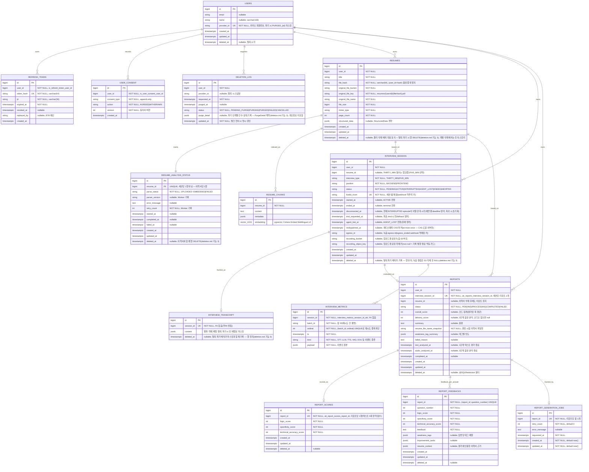

# ERD

전체 DB 스키마와 엔티티 관계. 코드(`@Entity`)가 스키마의 원천이며, 이 문서는 그 요약이다 — 컬럼 상세가 어긋나면 엔티티 코드가 우선한다.

## 공통 규칙

- **FK 제약 없음**: 도메인 간 참조(`user_id`, `resume_id` 등)는 FK 제약 없이 id만 보관하고 애플리케이션이 무결성을 관리한다(도메인 간 결합 최소화). 아래 다이어그램의 관계선은 논리적 참조다.
- **BaseEntity 상속 테이블**(`users`, `resumes`, `resume_analysis_status`, `interview_session`): `created_at`(NOT NULL)·`updated_at`(NOT NULL)·`deleted_at`(nullable, soft delete) 공통 보유. 시각은 전부 `timestamptz`(UTC Instant, 마이크로초 절삭).
- **soft delete 필터**: `resumes`는 `@SQLRestriction("deleted_at IS NULL")`로 자동 필터. `users`·`interview_session`은 필터 없이 경로별 수동 재확인(잠금 후 활성 재확인 패턴).

## 테이블 소유·비고

| 테이블 | 소유 | 비고 |
| --- | --- | --- |
| `users` · `refresh_token` · `user_consent` · `deletion_log` | Spring (E1) | `user_consent`는 append-only 이력. `deletion_log`는 auditing 미적용(명시 시각 관리) |
| `resumes` · `resume_analysis_status` | Spring (이력서) | 분석 상태는 Python Worker가 전이 기록(UPLOADED 이후). 탈퇴 파기 시 물리 삭제(deletion.md 기능 3) |
| `resume_chunks` | Python Worker | 테이블 생성·쓰기 모두 Worker 소관. pgvector 확장은 백엔드 리포(로컬 이미지·Testcontainers)가 제공. **예외**: 탈퇴 파기·개별 삭제 시 Spring이 `resume_id` 기준 DELETE(deletion.md 크로스 레포 계약) |
| `interview_session` | Spring (세션) | HBB1-18 신설, HBB1-294가 종료 전이(webhook·/end·스위퍼)와 `end_requested_at`·`agent_lost_at` 추가, HBB1-308이 재연결(`disconnected_at` 사용 개시)·재디스패치(`redispatched_at`) 추가. 인덱스 `(user_id, status)` |
| `interview_transcript` | Kkori-AI (에이전트) | 테이블 DDL·마이그레이션·쓰기 모두 에이전트 소관(Kkori-AI interview-end.md §4). Spring은 판별용 EXISTS 읽기만(HBB1-294 — interview-session-completion.md). dev/prod는 에이전트 배포가 테이블 존재의 선행 조건. **예외**: 탈퇴 파기 시 Spring이 `content = []`·`deleted_at` 마스킹 UPDATE(deletion.md 크로스 레포 계약) |
| `reports`, `report_scores`, `report_feedbacks` | 정의 Spring (리포트 엔티티), 행은 Python Worker | Worker가 INSERT, UPDATE로 생성 수명주기 전체를 맡고 Spring은 조회만 한다(save, delete 없음). DDL은 로컬 ddl-auto update로 생성, dev/prod는 validate. **예외**: 탈퇴 파기 시 Spring이 JDBC로 물리 삭제(deletion.md 기능 3) |
| `report_generation_jobs` | Python Worker | 테이블 생성, 쓰기 모두 Worker 소관(worker/src/report/repository.py). 리포트당 1행, 재시도 횟수와 오류 기록. Spring 미접근. **예외**: 탈퇴 파기 시 Spring이 JDBC로 DELETE(deletion.md 기능 3) |
| `interview_metrics` | Kkori-AI (에이전트) | agent/migrations/002. STT, LLM, TTS 등 파이프라인 메트릭을 이벤트당 1행 jsonb로 적재. Spring 미접근 |

## 마이그레이션 도구 도입 시 반영할 항목 (Flyway — 배포 스토리)

JPA 애너테이션으로 표현할 수 없어 보류 중인 DB 불변식·인덱스. baseline DDL 작성 시 포함할 것:

- `deletion_log`: 부분 UNIQUE 인덱스 `(user_id) WHERE status IN ('PENDING_PURGE','PURGING','FAILED')` — 유저당 활성 삭제 요청 1건 (account.md)
- `interview_session`: 부분 UNIQUE 인덱스 `(user_id) WHERE status NOT IN ('ENDED','ABORTED')` — 유저당 진행 중 세션 1개 (interview-session-creation.md)
- `interview_session`: `resume_id` 조회 인덱스 — `RESUME_IN_USE` 판정(`existsByResumeIdAndStatusIn`)이 현재 `(user_id, status)` 인덱스의 지원을 받지 못함. MVP 규모에서는 수용, DDL 작성 시 `(resume_id, status)` 검토
